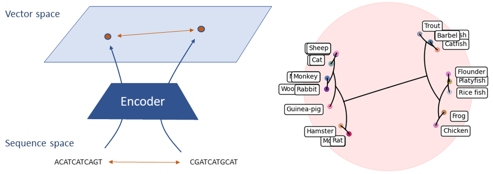

# Neural Sequence Distance Embeddings 

Official implementation of Neural Sequence Distance Embedding (Neural SEED) in PyTorch. Neural SEED is a novel framework to embed biological sequences in geometric vector spaces. The preprint of the project will be available soon.



## Overview

The repository is organised in four main folders one for each of the tasks analysed. Each of these contain scripts and models used for the task as well as instructions on how to run them and the tuned hyperparameters found. 

- `edit_distance` for the *edit distance approximation* task
- `closest_string` for the *closest string retrieval* task
- `hierarchical_clustering` for the *hierarchical clustering* task, further divided in `relaxed` and `unsupervised` for the two approaches explored
- `multiple_alignment` for the *multiple sequence alignment* task, further divided in `guide_tree` and `steiner_string`
- `util` contains a series of utility routines shared between all the tasks
- `tests` contains a wide range of tests for the various components of the repository 

## Installation

Create a virtual (or conda) environment and install the dependencies:

```
python3 -m venv neural_seed
source neural_seed/bin/activate
pip install -r requirements.txt
```

Then install the `mst` and `unionfind` packages used for the hierarchical clustering:

```
cd hierarchical_clustering/relaxed/mst; python setup.py build_ext --inplace; cd ../../..
cd hierarchical_clustering/relaxed/unionfind; python setup.py build_ext --inplace; cd ../../..
```


## Reference

The preprint of the project will be available soon.

## License

MIT

