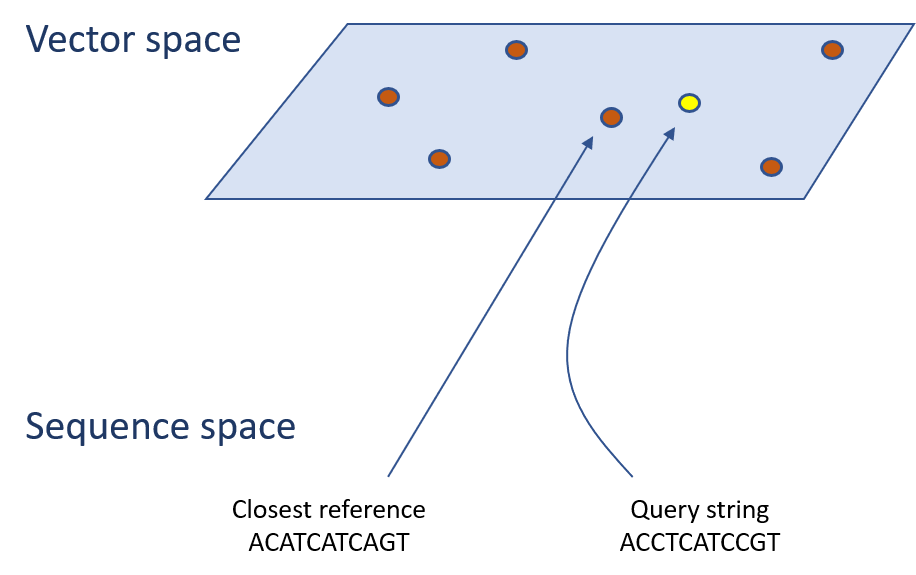
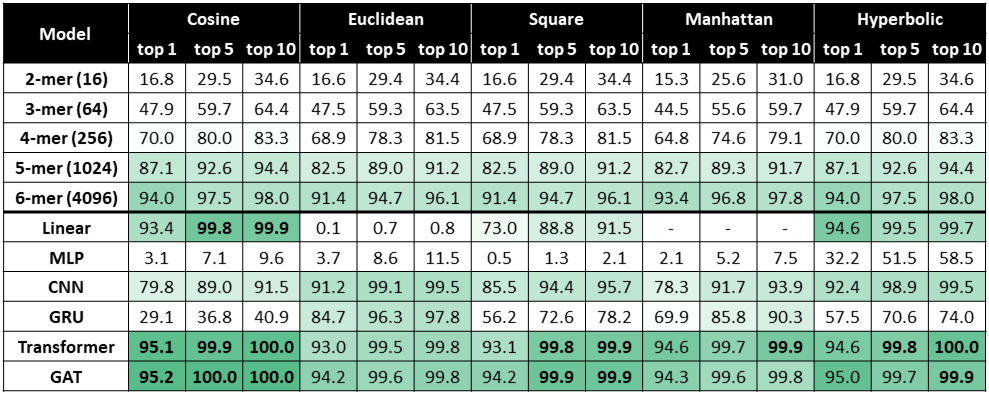

# Closest String Retrieval



## Folder structure:

- `triplet` contains code to run the triplet loss baseline models
- `task` contains scripts to generate and load the various datasets
- `test.py` contains the common testing routine for all the models, this is invoked by the `edit_distance/train.py` file

## Datasets

The pre-generated datasets used for the experiments can be downloaded from this [Google Drive folder](https://drive.google.com/drive/folders/1l42H0TYIhaJYyzx4GHhnmYmB2pslzVOl?usp=sharing) manually or via command line:

```
gdown --id 1pgfhRhhL41WoZDt5MYFm-PDIW3HvLMIp    # for the synthetic dataset
gdown --id 1hQSHR-oeuS9bDVE6ABHS0SoI4xk3zPnB    # for the Qiita dataset
```

## Tuned scripts

The tuned scripts for this task are those reported in the `edit_distance/README.md` file.




