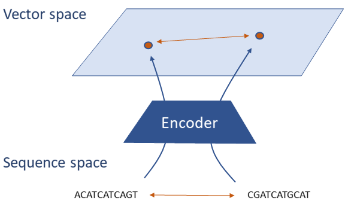
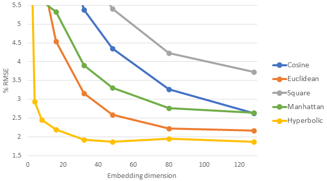
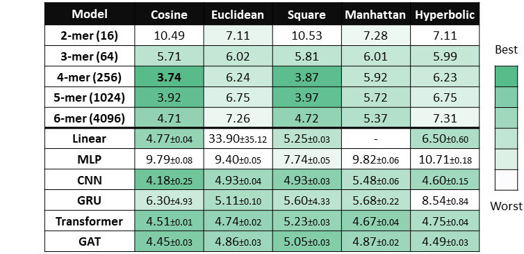
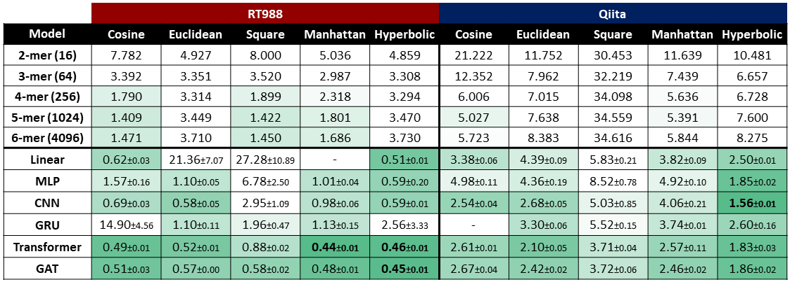

# Edit Distance Approximation



## Folder structure:

- `baselines` contains code to run the k-mer baseline
- `models` contains:
  -  `pair_encoder.py` which contains the encoder model wrapper which performs preprocessing and distance calculation
  -  a folder for every model with a `model.py` file with the `torch.nn.Module` class and a `train.py` file with the model specific argument parser
- `task` contains scripts to generate and load the various datasets
- `train.py` contains the common training and testing routine for all the models as well as the general argument parser



## Datasets

The pre-generated datasets used for the experiments can be downloaded from this [Google Drive folder](https://drive.google.com/drive/folders/1l42H0TYIhaJYyzx4GHhnmYmB2pslzVOl?usp=sharing) manually or via command line:

```
gdown --id 1P3cp-ypr1MtVKwMEpSeyejNy-FR01zel    # for the synthetic dataset
gdown --id 1yZTOYrnYdW9qRrwHSO5eRc8rYIPEVtY2    # for the Qiita dataset
gdown --id 1lEb1xaXw2e_XXGHceqaN3i0ntneiv7zZ    # for the RT988 dataset
gdown --id 1mlcEomGEtfgkwF4P6bXKwUeENcvhRAIp    # for the Greengenes dataset
```

## Tuned scripts



#### Synthetic dataset
```
# Linear
python -m edit_distance.models.feedforward.train --loss=mse --distance=cosine --lr=0.01 --weight_decay=0.0 --dropout=0.0 --embedding_size=128 --layer=1 --print_every=5 --patience=50 --epochs=500 --batch_size=128 --data="./edit_large_1024.pkl" --closest_data_path="./closest_large_1024.pkl" --hierarchical_data_path="./hc_1024_large.pkl"
python -m edit_distance.models.feedforward.train --loss=mse --distance=euclidean --lr=0.01 --weight_decay=1e-5 --dropout=0.2 --embedding_size=128 --layer=1 --print_every=5 --patience=50 --epochs=500 --batch_size=128 --data="./edit_large_1024.pkl" --closest_data_path="./closest_large_1024.pkl" --hierarchical_data_path="./hc_1024_large.pkl"
python -m edit_distance.models.feedforward.train --scaling=True --loss=mse --distance=hyperbolic --lr=0.01 --weight_decay=0.0 --dropout=0.0 --embedding_size=128 --layer=1 --print_every=5 --patience=50 --epochs=500 --batch_size=128 --data="./edit_large_1024.pkl" --closest_data_path="./closest_large_1024.pkl" --hierarchical_data_path="./hc_1024_large.pkl"
python -m edit_distance.models.feedforward.train --loss=mse --distance=square --lr=0.01 --weight_decay=1e-5 --dropout=0.0 --embedding_size=128 --layer=1 --print_every=5 --patience=50 --epochs=500 --batch_size=128 --data="./edit_large_1024.pkl" --closest_data_path="./closest_large_1024.pkl" --hierarchical_data_path="./hc_1024_large.pkl"

# MLP
python -m edit_distance.models.feedforward.train --loss=mse --distance=cosine --batch_norm=True --lr=0.01 --weight_decay=1e-5 --dropout=0.0 --embedding_size=128 --hidden_size=128 --layer=2 --print_every=5 --patience=50 --epochs=500 --batch_size=128 --data="./edit_large_1024.pkl" --closest_data_path="./closest_large_1024.pkl" --hierarchical_data_path="./hc_1024_large.pkl"
python -m edit_distance.models.feedforward.train --loss=mse --distance=euclidean --batch_norm=True --lr=0.01 --weight_decay=1e-5 --dropout=0.0 --embedding_size=128 --hidden_size=128 --layer=2 --print_every=5 --patience=50 --epochs=500 --batch_size=128 --data="./edit_large_1024.pkl" --closest_data_path="./closest_large_1024.pkl" --hierarchical_data_path="./hc_1024_large.pkl"
python -m edit_distance.models.feedforward.train --scaling=True --loss=mse --distance=hyperbolic --batch_norm=True --lr=0.01 --weight_decay=0.0 --dropout=0.0 --embedding_size=128 --hidden_size=128 --layer=2 --print_every=5 --patience=50 --epochs=500 --batch_size=128 --data="./edit_large_1024.pkl" --closest_data_path="./closest_large_1024.pkl" --hierarchical_data_path="./hc_1024_large.pkl"
python -m edit_distance.models.feedforward.train --loss=mse --distance=manhattan --batch_norm=True --lr=0.01 --weight_decay=1e-5 --dropout=0.0 --embedding_size=128 --hidden_size=128 --layer=2 --print_every=5 --patience=50 --epochs=500 --batch_size=128 --data="./edit_large_1024.pkl" --closest_data_path="./closest_large_1024.pkl" --hierarchical_data_path="./hc_1024_large.pkl"
python -m edit_distance.models.feedforward.train --loss=mse --distance=square --batch_norm=True --lr=0.01 --weight_decay=1e-5 --dropout=0.0 --embedding_size=128 --hidden_size=256 --layer=2 --print_every=5 --patience=50 --epochs=500 --batch_size=128 --data="./edit_large_1024.pkl" --closest_data_path="./closest_large_1024.pkl" --hierarchical_data_path="./hc_1024_large.pkl"

# CNN
python -m edit_distance.models.cnn.train --distance=cosine --loss=mse --batch_norm=True --lr=0.01 --weight_decay=0.0 --dropout=0.0 --embedding_size=128 --channels=32 --kernel_size=3 --pooling=avg --non_linearity=True --layers=4 --readout_layers=1 --print_every=5 --epochs=500 --patience=50 --batch_size=128 --data="./edit_large_1024.pkl" --closest_data_path="./closest_large_1024.pkl" --hierarchical_data_path="./hc_1024_large.pkl"
python -m edit_distance.models.cnn.train --distance=euclidean --loss=mse --batch_norm=True --lr=0.01 --weight_decay=0.0 --dropout=0.0 --embedding_size=128 --channels=16 --kernel_size=3 --pooling=avg --non_linearity=True --layers=4 --readout_layers=1 --print_every=5 --epochs=500 --patience=50 --batch_size=128 --data="./edit_large_1024.pkl" --closest_data_path="./closest_large_1024.pkl" --hierarchical_data_path="./hc_1024_large.pkl"
python -m edit_distance.models.cnn.train --scaling=True --distance=hyperbolic --loss=mse --batch_norm=True --lr=0.01 --weight_decay=0.0 --dropout=0.0 --embedding_size=128 --channels=32 --kernel_size=3 --pooling=avg --non_linearity=True --layers=4 --readout_layers=1 --print_every=5 --epochs=500 --patience=50 --batch_size=128 --data="./edit_large_1024.pkl" --closest_data_path="./closest_large_1024.pkl" --hierarchical_data_path="./hc_1024_large.pkl"
python -m edit_distance.models.cnn.train --distance=manhattan --loss=mse --batch_norm=True --lr=0.01 --weight_decay=0.0 --dropout=0.0 --embedding_size=128 --channels=32 --kernel_size=3 --pooling=avg --non_linearity=True --layers=4 --readout_layers=1 --print_every=5 --epochs=500 --patience=50 --batch_size=128 --data="./edit_large_1024.pkl" --closest_data_path="./closest_large_1024.pkl" --hierarchical_data_path="./hc_1024_large.pkl"
python -m edit_distance.models.cnn.train --distance=square --loss=mse --batch_norm=True --lr=0.01 --weight_decay=0.0 --dropout=0.0 --embedding_size=128 --channels=16 --kernel_size=3 --pooling=avg --non_linearity=True --layers=4 --readout_layers=1 --print_every=5 --epochs=500 --patience=50 --batch_size=128 --data="./edit_large_1024.pkl" --closest_data_path="./closest_large_1024.pkl" --hierarchical_data_path="./hc_1024_large.pkl"

# GRU
python -m edit_distance.models.recurrent.train --distance=cosine --loss=mse --lr=0.01 --weight_decay=1e-6 --dropout=0.0 --embedding_size=128 --hidden_size=128 --recurrent_layers=1 --readout_layers=1 --print_every=5 --patience=50 --epochs=500 --batch_size=128 --data="./edit_large_1024.pkl" --closest_data_path="./closest_large_1024.pkl" --hierarchical_data_path="./hc_1024_large.pkl" --extr_data_path="./edit_extr_1024.pkl"
python -m edit_distance.models.recurrent.train --distance=euclidean --loss=mse --lr=0.01 --weight_decay=1e-6 --dropout=0.0 --embedding_size=128 --hidden_size=128 --recurrent_layers=1 --readout_layers=1 --print_every=5 --patience=50 --epochs=500 --batch_size=128 --data="./edit_large_1024.pkl" --closest_data_path="./closest_large_1024.pkl" --hierarchical_data_path="./hc_1024_large.pkl" --extr_data_path="./edit_extr_1024.pkl"
python -m edit_distance.models.recurrent.train --scaling=True --distance=hyperbolic --loss=mse --lr=0.01 --weight_decay=0.0 --dropout=0.0 --embedding_size=128 --hidden_size=128 --recurrent_layers=1 --readout_layers=1 --print_every=5 --patience=50 --epochs=500 --batch_size=128 --data="./edit_large_1024.pkl" --closest_data_path="./closest_large_1024.pkl" --hierarchical_data_path="./hc_1024_large.pkl" --extr_data_path="./edit_extr_1024.pkl"
python -m edit_distance.models.recurrent.train --distance=manhattan --loss=mse --lr=0.01 --weight_decay=1e-6 --dropout=0.0 --embedding_size=128 --hidden_size=128 --recurrent_layers=1 --readout_layers=1 --print_every=5 --patience=50 --epochs=500 --batch_size=128 --data="./edit_large_1024.pkl" --closest_data_path="./closest_large_1024.pkl" --hierarchical_data_path="./hc_1024_large.pkl" --extr_data_path="./edit_extr_1024.pkl"
python -m edit_distance.models.recurrent.train --distance=square --loss=mse --lr=0.01 --weight_decay=1e-5 --dropout=0.0 --embedding_size=128 --hidden_size=128 --recurrent_layers=1 --readout_layers=1 --print_every=5 --patience=50 --epochs=500 --batch_size=128 --data="./edit_large_1024.pkl" --closest_data_path="./closest_large_1024.pkl" --hierarchical_data_path="./hc_1024_large.pkl" --extr_data_path="./edit_extr_1024.pkl"

# Global Transformer
python -m edit_distance.models.transformer.train --segment_size=16 --heads=1 --trans_layers=2 --hidden_size=16 --layer_norm=True --epochs=500 --distance=cosine --loss=mse --lr=0.001 --weight_decay=0.0 --dropout=0.0 --embedding_size=128 --readout_layers=1 --print_every=5 --patience=50 --batch_size=128 --data="./edit_large_1024.pkl" --closest_data_path="./closest_large_1024.pkl" --hierarchical_data_path="./hc_1024_large.pkl"
python -m edit_distance.models.transformer.train --segment_size=16 --heads=1 --trans_layers=2 --hidden_size=8 --layer_norm=True --epochs=500 --distance=euclidean --loss=mse --lr=0.001 --weight_decay=0.0 --dropout=0.0 --embedding_size=128 --readout_layers=1 --print_every=5 --patience=50 --batch_size=128 --data="./edit_large_1024.pkl" --closest_data_path="./closest_large_1024.pkl" --hierarchical_data_path="./hc_1024_large.pkl"
python -m edit_distance.models.transformer.train --scaling=True --segment_size=8 --heads=1 --trans_layers=2 --hidden_size=16 --layer_norm=True --epochs=500 --distance=hyperbolic --loss=mse --lr=0.001 --weight_decay=0.0 --dropout=0.0 --embedding_size=128 --readout_layers=1 --print_every=5 --patience=50 --batch_size=128 --data="./edit_large_1024.pkl" --closest_data_path="./closest_large_1024.pkl" --hierarchical_data_path="./hc_1024_large.pkl"
python -m edit_distance.models.transformer.train --segment_size=16 --heads=2 --trans_layers=2 --hidden_size=8 --layer_norm=True --epochs=500 --distance=manhattan --loss=mse --lr=0.001 --weight_decay=0.0 --dropout=0.0 --embedding_size=128 --readout_layers=1 --print_every=5 --patience=50 --batch_size=128 --data="./edit_large_1024.pkl" --closest_data_path="./closest_large_1024.pkl" --hierarchical_data_path="./hc_1024_large.pkl"
python -m edit_distance.models.transformer.train --segment_size=16 --heads=2 --trans_layers=2 --hidden_size=16 --layer_norm=True --epochs=500 --distance=square --loss=mse --lr=0.001 --weight_decay=1e-5 --dropout=0.0 --embedding_size=128 --readout_layers=1 --print_every=5 --patience=50 --batch_size=128 --data="./edit_large_1024.pkl" --closest_data_path="./closest_large_1024.pkl" --hierarchical_data_path="./hc_1024_large.pkl"

# Local Transformer
python -m edit_distance.models.transformer.train --mask=local1 --segment_size=16 --heads=1 --trans_layers=2 --hidden_size=16 --layer_norm=True --epochs=500 --distance=cosine --loss=mse --lr=0.001 --weight_decay=0.0 --dropout=0.0 --embedding_size=128 --readout_layers=1 --print_every=5 --patience=50 --batch_size=128 --data="./edit_large_1024.pkl" --closest_data_path="./closest_large_1024.pkl" --hierarchical_data_path="./hc_1024_large.pkl"
python -m edit_distance.models.transformer.train --mask=local1 --segment_size=16 --heads=2 --trans_layers=2 --hidden_size=16 --layer_norm=True --epochs=500 --distance=euclidean --loss=mse --lr=0.001 --weight_decay=0.0 --dropout=0.0 --embedding_size=128 --readout_layers=1 --print_every=5 --patience=50 --batch_size=128 --data="./edit_large_1024.pkl" --closest_data_path="./closest_large_1024.pkl" --hierarchical_data_path="./hc_1024_large.pkl"
python -m edit_distance.models.transformer.train --scaling=True --mask=local1 --segment_size=16 --heads=1 --trans_layers=2 --hidden_size=16 --layer_norm=True --epochs=500 --distance=hyperbolic --loss=mse --lr=0.001 --weight_decay=0.0 --dropout=0.0 --embedding_size=128 --readout_layers=1 --print_every=5 --patience=50 --batch_size=128 --data="./edit_large_1024.pkl" --closest_data_path="./closest_large_1024.pkl" --hierarchical_data_path="./hc_1024_large.pkl"
python -m edit_distance.models.transformer.train --mask=local1 --segment_size=16 --heads=2 --trans_layers=2 --hidden_size=16 --layer_norm=True --epochs=500 --distance=manhattan --loss=mse --lr=0.001 --weight_decay=0.0 --dropout=0.0 --embedding_size=128 --readout_layers=1 --print_every=5 --patience=50 --batch_size=128 --data="./edit_large_1024.pkl" --closest_data_path="./closest_large_1024.pkl" --hierarchical_data_path="./hc_1024_large.pkl"
python -m edit_distance.models.transformer.train --mask=local1 --segment_size=16 --heads=1 --trans_layers=2 --hidden_size=16 --layer_norm=True --epochs=500 --distance=square --loss=mse --lr=0.001 --weight_decay=0.0 --dropout=0.0 --embedding_size=128 --readout_layers=1 --print_every=5 --patience=50 --batch_size=128 --data="./edit_large_1024.pkl" --closest_data_path="./closest_large_1024.pkl" --hierarchical_data_path="./hc_1024_large.pkl"
```



#### RT988 dataset

```
# Linear
python -m edit_distance.models.feedforward.train --loss=mse --distance=cosine --lr=0.01 --weight_decay=0.0 --dropout=0.0 --embedding_size=128 --layer=1 --print_every=5 --patience=50 --epochs=500 --batch_size=128 --data="./edit_genome_large.pkl"  --hierarchical_data_path="./hc_genomic_large.pkl"
python -m edit_distance.models.feedforward.train --loss=mse --distance=euclidean --lr=0.01 --weight_decay=1e-5 --dropout=0.2 --embedding_size=128 --layer=1 --print_every=5 --patience=50 --epochs=500 --batch_size=128 --data="./edit_genome_large.pkl"  --hierarchical_data_path="./hc_genomic_large.pkl"
python -m edit_distance.models.feedforward.train --loss=mse --scaling=False --distance=hyperbolic --lr=0.001 --weight_decay=0.0 --dropout=0.0 --embedding_size=128 --layer=1 --print_every=50 --patience=50 --epochs=500 --batch_size=128 --data="./edit_genome_large.pkl"  --hierarchical_data_path="./hc_genomic_large.pkl"
python -m edit_distance.models.feedforward.train --loss=mse --distance=manhattan --lr=0.01 --weight_decay=0.0 --dropout=0.0 --embedding_size=128 --layer=1 --print_every=5 --patience=50 --epochs=500 --batch_size=128 --data="./edit_genome_large.pkl"  --hierarchical_data_path="./hc_genomic_large.pkl"
python -m edit_distance.models.feedforward.train --loss=mse --distance=square --lr=0.01 --weight_decay=0.0 --dropout=0.0 --embedding_size=128 --layer=1 --print_every=5 --patience=50 --epochs=500 --batch_size=128 --data="./edit_genome_large.pkl"  --hierarchical_data_path="./hc_genomic_large.pkl"

# MLP
python -m edit_distance.models.feedforward.train --loss=mse --distance=cosine --batch_norm=True --lr=0.01 --weight_decay=1e-5 --dropout=0.0 --embedding_size=128 --hidden_size=256 --layer=3 --print_every=5 --patience=50 --epochs=500 --batch_size=128 --data="./edit_genome_large.pkl"  --hierarchical_data_path="./hc_genomic_large.pkl"
python -m edit_distance.models.feedforward.train --loss=mse --distance=euclidean --batch_norm=True --lr=0.01 --weight_decay=1e-5 --dropout=0.0 --embedding_size=128 --hidden_size=256 --layer=2 --print_every=5 --patience=50 --epochs=500 --batch_size=128 --data="./edit_genome_large.pkl"  --hierarchical_data_path="./hc_genomic_large.pkl"
python -m edit_distance.models.feedforward.train --scaling=True --loss=mse --distance=hyperbolic --batch_norm=True --lr=0.01 --weight_decay=0.0 --dropout=0.0 --embedding_size=128 --hidden_size=256 --layer=3 --print_every=5 --patience=50 --epochs=500 --batch_size=128 --data="./edit_genome_large.pkl"  --hierarchical_data_path="./hc_genomic_large.pkl"
python -m edit_distance.models.feedforward.train --loss=mse --distance=manhattan --batch_norm=True --lr=0.01 --weight_decay=1e-5 --dropout=0.0 --embedding_size=128 --hidden_size=128 --layer=2 --print_every=5 --patience=50 --epochs=500 --batch_size=128 --data="./edit_genome_large.pkl"  --hierarchical_data_path="./hc_genomic_large.pkl"
python -m edit_distance.models.feedforward.train --loss=mse --distance=square --batch_norm=True --lr=0.01 --weight_decay=1e-5 --dropout=0.0 --embedding_size=128 --hidden_size=256 --layer=3 --print_every=5 --patience=50 --epochs=500 --batch_size=128 --data="./edit_genome_large.pkl"  --hierarchical_data_path="./hc_genomic_large.pkl"

# CNN
python -m edit_distance.models.cnn.train --distance=cosine --loss=mse --batch_norm=True --lr=0.01 --weight_decay=0.0 --dropout=0.0 --embedding_size=128 --channels=16 --kernel_size=5 --pooling=none --non_linearity=True --layers=4 --readout_layers=1 --print_every=5 --epochs=500 --patience=50 --batch_size=128 --data="./edit_genome_large.pkl"  --hierarchical_data_path="./hc_genomic_large.pkl"
python -m edit_distance.models.cnn.train --distance=euclidean --loss=mse --batch_norm=True --lr=0.01 --weight_decay=0.0 --dropout=0.0 --embedding_size=128 --channels=32 --kernel_size=5 --pooling=avg --non_linearity=True --layers=4 --readout_layers=1 --print_every=5 --epochs=500 --patience=50 --batch_size=128 --data="./edit_genome_large.pkl"  --hierarchical_data_path="./hc_genomic_large.pkl"
python -m edit_distance.models.cnn.train --scaling=True --distance=hyperbolic --loss=mse --batch_norm=True --lr=0.01 --weight_decay=0.0 --dropout=0.0 --embedding_size=128 --channels=32 --kernel_size=3 --pooling=none --non_linearity=True --layers=4 --readout_layers=1 --print_every=5 --epochs=500 --patience=50 --batch_size=128 --data="./edit_genome_large.pkl"  --hierarchical_data_path="./hc_genomic_large.pkl"
python -m edit_distance.models.cnn.train --distance=manhattan --loss=mse --batch_norm=True --lr=0.01 --weight_decay=0.0 --dropout=0.0 --embedding_size=128 --channels=16 --kernel_size=3 --pooling=avg --non_linearity=True --layers=4 --readout_layers=1 --print_every=5 --epochs=500 --patience=50 --batch_size=128 --data="./edit_genome_large.pkl"  --hierarchical_data_path="./hc_genomic_large.pkl"
python -m edit_distance.models.cnn.train --distance=square --loss=mse --batch_norm=True --lr=0.01 --weight_decay=0.0 --dropout=0.0 --embedding_size=128 --channels=32 --kernel_size=3 --pooling=none --non_linearity=True --layers=4 --readout_layers=1 --print_every=5 --epochs=500 --patience=50 --batch_size=128 --data="./edit_genome_large.pkl"  --hierarchical_data_path="./hc_genomic_large.pkl"

# GRU
python -m edit_distance.models.recurrent.train --distance=cosine --loss=mse --lr=0.01 --weight_decay=1e-5 --dropout=0.0 --embedding_size=128 --hidden_size=256 --recurrent_layers=1 --readout_layers=1 --print_every=5 --patience=50 --epochs=500 --batch_size=128 --data="./edit_genome_large.pkl"  --hierarchical_data_path="./hc_genomic_large.pkl"
python -m edit_distance.models.recurrent.train --distance=euclidean --loss=mse --lr=0.01 --weight_decay=1e-6 --dropout=0.0 --embedding_size=128 --hidden_size=128 --recurrent_layers=1 --readout_layers=1 --print_every=5 --patience=50 --epochs=500 --batch_size=128 --data="./edit_genome_large.pkl"  --hierarchical_data_path="./hc_genomic_large.pkl"
python -m edit_distance.models.recurrent.train --scaling=True --distance=hyperbolic --loss=mse --lr=0.01 --weight_decay=0.0 --dropout=0.0 --embedding_size=128 --hidden_size=128 --recurrent_layers=1 --readout_layers=1 --print_every=5 --patience=50 --epochs=500 --batch_size=128 --data="./edit_genome_large.pkl"  --hierarchical_data_path="./hc_genomic_large.pkl"
python -m edit_distance.models.recurrent.train --distance=manhattan --loss=mse --lr=0.01 --weight_decay=1e-6 --dropout=0.0 --embedding_size=128 --hidden_size=128 --recurrent_layers=2 --readout_layers=1 --print_every=5 --patience=50 --epochs=500 --batch_size=128 --data="./edit_genome_large.pkl"  --hierarchical_data_path="./hc_genomic_large.pkl"
python -m edit_distance.models.recurrent.train --distance=square --loss=mse --lr=0.01 --weight_decay=1e-6 --dropout=0.0 --embedding_size=128 --hidden_size=128 --recurrent_layers=1 --readout_layers=1 --print_every=5 --patience=50 --epochs=500 --batch_size=128 --data="./edit_genome_large.pkl"  --hierarchical_data_path="./hc_genomic_large.pkl"

# Global Transformer
python -m edit_distance.models.transformer.train --segment_size=5 --heads=2 --trans_layers=2 --hidden_size=16 --layer_norm=True --epochs=500 --distance=cosine --loss=mse --lr=0.001 --weight_decay=0.0 --dropout=0.0 --embedding_size=128 --readout_layers=1 --print_every=5 --patience=50 --batch_size=128 --data="./edit_genome_large.pkl"  --hierarchical_data_path="./hc_genomic_large.pkl"
python -m edit_distance.models.transformer.train --segment_size=15 --heads=2 --trans_layers=1 --hidden_size=16 --layer_norm=True --epochs=500 --distance=euclidean --loss=mse --lr=0.001 --weight_decay=0.0 --dropout=0.0 --embedding_size=128 --readout_layers=1 --print_every=5 --patience=50 --batch_size=128 --data="./edit_genome_large.pkl"  --hierarchical_data_path="./hc_genomic_large.pkl"
python -m edit_distance.models.transformer.train --scaling=True --segment_size=5 --heads=1 --trans_layers=1 --hidden_size=16 --layer_norm=True --epochs=500 --distance=hyperbolic --loss=mse --lr=0.001 --weight_decay=0.0 --dropout=0.0 --embedding_size=128 --readout_layers=1 --print_every=5 --patience=50 --batch_size=128 --data="./edit_genome_large.pkl"  --hierarchical_data_path="./hc_genomic_large.pkl"
python -m edit_distance.models.transformer.train --segment_size=5 --heads=2 --trans_layers=1 --hidden_size=8 --layer_norm=True --epochs=500 --distance=manhattan --loss=mse --lr=0.001 --weight_decay=0.0 --dropout=0.0 --embedding_size=128 --readout_layers=1 --print_every=5 --patience=50 --batch_size=128 --data="./edit_genome_large.pkl"  --hierarchical_data_path="./hc_genomic_large.pkl"
python -m edit_distance.models.transformer.train --segment_size=15 --heads=1 --trans_layers=1 --hidden_size=16 --layer_norm=True --epochs=500 --distance=square --loss=mse --lr=0.001 --weight_decay=1e-5 --dropout=0.0 --embedding_size=128 --readout_layers=1 --print_every=5 --patience=50 --batch_size=128 --data="./edit_genome_large.pkl"  --hierarchical_data_path="./hc_genomic_large.pkl"

# Local Transformer
python -m edit_distance.models.transformer.train --mask=local1 --segment_size=5 --heads=1 --trans_layers=2 --hidden_size=16 --layer_norm=True --epochs=500 --distance=cosine --loss=mse --lr=0.001 --weight_decay=0.0 --dropout=0.0 --embedding_size=128 --readout_layers=1 --print_every=5 --patience=50 --batch_size=128 --data="./edit_genome_large.pkl"  --hierarchical_data_path="./hc_genomic_large.pkl"
python -m edit_distance.models.transformer.train --mask=local1 --segment_size=5 --heads=1 --trans_layers=2 --hidden_size=16 --layer_norm=True --epochs=500 --distance=euclidean --loss=mse --lr=0.001 --weight_decay=0.0 --dropout=0.0 --embedding_size=128 --readout_layers=1 --print_every=5 --patience=50 --batch_size=128 --data="./edit_genome_large.pkl"  --hierarchical_data_path="./hc_genomic_large.pkl"
python -m edit_distance.models.transformer.train --mask=local1 --scaling=True --segment_size=5 --heads=1 --trans_layers=1 --hidden_size=16 --layer_norm=True --epochs=500 --distance=hyperbolic --loss=mse --lr=0.001 --weight_decay=0.0 --dropout=0.0 --embedding_size=128 --readout_layers=1 --print_every=5 --patience=50 --batch_size=128 --data="./edit_genome_large.pkl"  --hierarchical_data_path="./hc_genomic_large.pkl"
python -m edit_distance.models.transformer.train --mask=local1 --segment_size=5 --heads=1 --trans_layers=2 --hidden_size=16 --layer_norm=True --epochs=500 --distance=manhattan --loss=mse --lr=0.001 --weight_decay=0.0 --dropout=0.0 --embedding_size=128 --readout_layers=1 --print_every=5 --patience=50 --batch_size=128 --data="./edit_genome_large.pkl"  --hierarchical_data_path="./hc_genomic_large.pkl"
python -m edit_distance.models.transformer.train --mask=local1 --segment_size=5 --heads=1 --trans_layers=2 --hidden_size=16 --layer_norm=True --epochs=500 --distance=square --loss=mse --lr=0.001 --weight_decay=0.0 --dropout=0.0 --embedding_size=128 --readout_layers=1 --print_every=5 --patience=50 --batch_size=128 --data="./edit_genome_large.pkl"  --hierarchical_data_path="./hc_genomic_large.pkl"
```

#### Qiita dataset

```
# Linear
python -m edit_distance.models.feedforward.train --distance=cosine --lr=0.01 --weight_decay=0.0 --dropout=0.0 --embedding_size=128 --layer=1 --print_every=5 --patience=50 --epochs=500 --batch_size=128 --data="./edit_qiita_large.pkl" --closest_data_path="./closest_qiita_large.pkl" --hierarchical_data_path="./hc_qiita_large_extr.pkl"
python -m edit_distance.models.feedforward.train --distance=euclidean --lr=0.01 --weight_decay=0.0 --dropout=0.0 --embedding_size=128 --layer=1 --print_every=5 --patience=50 --epochs=500 --batch_size=128 --data="./edit_qiita_large.pkl" --closest_data_path="./closest_qiita_large.pkl" --hierarchical_data_path="./hc_qiita_large_extr.pkl"
python -m edit_distance.models.feedforward.train --scaling=False --distance=hyperbolic --lr=0.01 --weight_decay=0.0 --dropout=0.0 --embedding_size=128 --layer=1 --print_every=5 --patience=50 --epochs=500 --batch_size=128 --data="./edit_qiita_large.pkl" --closest_data_path="./closest_qiita_large.pkl" --hierarchical_data_path="./hc_qiita_large_extr.pkl"
python -m edit_distance.models.feedforward.train --distance=manhattan --lr=0.01 --weight_decay=0.0 --dropout=0.0 --embedding_size=128 --layer=1 --print_every=5 --patience=50 --epochs=500 --batch_size=128 --data="./edit_qiita_large.pkl" --closest_data_path="./closest_qiita_large.pkl" --hierarchical_data_path="./hc_qiita_large_extr.pkl"
python -m edit_distance.models.feedforward.train --distance=square --lr=0.01 --weight_decay=0.0 --dropout=0.0 --embedding_size=128 --layer=1 --print_every=5 --patience=50 --epochs=500 --batch_size=128 --data="./edit_qiita_large.pkl" --closest_data_path="./closest_qiita_large.pkl" --hierarchical_data_path="./hc_qiita_large_extr.pkl"

# MLP
python -m edit_distance.models.feedforward.train --distance=cosine --batch_norm=True --lr=0.01 --weight_decay=1e-5 --dropout=0.0 --embedding_size=128 --hidden_size=256 --layer=2 --print_every=5 --patience=50 --epochs=500 --batch_size=128 --data="./edit_qiita_large.pkl" --closest_data_path="./closest_qiita_large.pkl" --hierarchical_data_path="./hc_qiita_large_extr.pkl"
python -m edit_distance.models.feedforward.train --distance=euclidean --batch_norm=True --lr=0.01 --weight_decay=1e-5 --dropout=0.0 --embedding_size=128 --hidden_size=128 --layer=2 --print_every=5 --patience=50 --epochs=500 --batch_size=128 --data="./edit_qiita_large.pkl" --closest_data_path="./closest_qiita_large.pkl" --hierarchical_data_path="./hc_qiita_large_extr.pkl"
python -m edit_distance.models.feedforward.train --scaling=True --distance=hyperbolic --batch_norm=True --lr=0.01 --weight_decay=0.0 --dropout=0.0 --embedding_size=128 --hidden_size=256 --layer=3 --print_every=5 --patience=50 --epochs=500 --batch_size=128 --data="./edit_qiita_large.pkl" --closest_data_path="./closest_qiita_large.pkl" --hierarchical_data_path="./hc_qiita_large_extr.pkl"
python -m edit_distance.models.feedforward.train --distance=manhattan --batch_norm=True --lr=0.01 --weight_decay=1e-5 --dropout=0.0 --embedding_size=128 --hidden_size=128 --layer=2 --print_every=5 --patience=50 --epochs=500 --batch_size=128 --data="./edit_qiita_large.pkl" --closest_data_path="./closest_qiita_large.pkl" --hierarchical_data_path="./hc_qiita_large_extr.pkl"
python -m edit_distance.models.feedforward.train --distance=square --batch_norm=True --lr=0.01 --weight_decay=1e-5 --dropout=0.0 --embedding_size=128 --hidden_size=128 --layer=2 --print_every=5 --patience=50 --epochs=500 --batch_size=128 --data="./edit_qiita_large.pkl" --closest_data_path="./closest_qiita_large.pkl" --hierarchical_data_path="./hc_qiita_large_extr.pkl"

# CNN
python -m edit_distance.models.cnn.train --distance=cosine --batch_norm=True --lr=0.01 --weight_decay=0.0 --dropout=0.0 --embedding_size=128 --channels=32 --kernel_size=5 --pooling=avg --non_linearity=True --layers=4 --readout_layers=1 --print_every=5 --epochs=500 --patience=50 --batch_size=128 --data="./edit_qiita_large.pkl" --closest_data_path="./closest_qiita_large.pkl" --hierarchical_data_path="./hc_qiita_large_extr.pkl"
python -m edit_distance.models.cnn.train --distance=euclidean --batch_norm=True --lr=0.01 --weight_decay=0.0 --dropout=0.0 --embedding_size=128 --channels=16 --kernel_size=5 --pooling=avg --non_linearity=True --layers=4 --readout_layers=1 --print_every=5 --epochs=500 --patience=50 --batch_size=128 --data="./edit_qiita_large.pkl" --closest_data_path="./closest_qiita_large.pkl" --hierarchical_data_path="./hc_qiita_large_extr.pkl"
python -m edit_distance.models.cnn.train --scaling=False --distance=hyperbolic --batch_norm=True --lr=0.01 --weight_decay=0.0 --dropout=0.0 --embedding_size=128 --channels=32 --kernel_size=3 --pooling=avg --non_linearity=True --layers=4 --readout_layers=1 --print_every=5 --epochs=500 --patience=50 --batch_size=128 --data="./edit_qiita_large.pkl" --closest_data_path="./closest_qiita_large.pkl" --hierarchical_data_path="./hc_qiita_large_extr.pkl"
python -m edit_distance.models.cnn.train --distance=manhattan --batch_norm=True --lr=0.01 --weight_decay=0.0 --dropout=0.0 --embedding_size=128 --channels=16 --kernel_size=3 --pooling=avg --non_linearity=True --layers=4 --readout_layers=1 --print_every=5 --epochs=500 --patience=50 --batch_size=128 --data="./edit_qiita_large.pkl" --closest_data_path="./closest_qiita_large.pkl" --hierarchical_data_path="./hc_qiita_large_extr.pkl"
python -m edit_distance.models.cnn.train --distance=square --batch_norm=True --lr=0.01 --weight_decay=0.0 --dropout=0.0 --embedding_size=128 --channels=32 --kernel_size=5 --pooling=avg --non_linearity=True --layers=4 --readout_layers=1 --print_every=5 --epochs=500 --patience=50 --batch_size=128 --data="./edit_qiita_large.pkl" --closest_data_path="./closest_qiita_large.pkl" --hierarchical_data_path="./hc_qiita_large_extr.pkl"

# GRU
python -m edit_distance.models.recurrent.train --distance=cosine --lr=0.01 --weight_decay=1e-6 --dropout=0.0 --embedding_size=128 --hidden_size=128 --recurrent_layers=1 --readout_layers=1 --print_every=5 --patience=50 --epochs=500 --batch_size=128 --data="./edit_qiita_large.pkl" --closest_data_path="./closest_qiita_large.pkl" --hierarchical_data_path="./hc_qiita_large_extr.pkl"
python -m edit_distance.models.recurrent.train --distance=euclidean --lr=0.01 --weight_decay=1e-6 --dropout=0.0 --embedding_size=128 --hidden_size=128 --recurrent_layers=1 --readout_layers=1 --print_every=5 --patience=50 --epochs=500 --batch_size=128 --data="./edit_qiita_large.pkl" --closest_data_path="./closest_qiita_large.pkl" --hierarchical_data_path="./hc_qiita_large_extr.pkl"
python -m edit_distance.models.recurrent.train --scaling=False --distance=hyperbolic --lr=0.01 --weight_decay=0.0 --dropout=0.0 --embedding_size=128 --hidden_size=128 --recurrent_layers=1 --readout_layers=1 --print_every=5 --patience=50 --epochs=500 --batch_size=128 --data="./edit_qiita_large.pkl" --closest_data_path="./closest_qiita_large.pkl" --hierarchical_data_path="./hc_qiita_large_extr.pkl"
python -m edit_distance.models.recurrent.train --distance=manhattan --lr=0.01 --weight_decay=1e-6 --dropout=0.0 --embedding_size=128 --hidden_size=128 --recurrent_layers=2 --readout_layers=1 --print_every=5 --patience=50 --epochs=500 --batch_size=128 --data="./edit_qiita_large.pkl" --closest_data_path="./closest_qiita_large.pkl" --hierarchical_data_path="./hc_qiita_large_extr.pkl"
python -m edit_distance.models.recurrent.train --distance=square --lr=0.01 --weight_decay=1e-6 --dropout=0.0 --embedding_size=128 --hidden_size=128 --recurrent_layers=1 --readout_layers=1 --print_every=5 --patience=50 --epochs=500 --batch_size=128 --data="./edit_qiita_large.pkl" --closest_data_path="./closest_qiita_large.pkl" --hierarchical_data_path="./hc_qiita_large_extr.pkl"

# Global Transformer
python -m edit_distance.models.transformer.train --segment_size=4 --heads=2 --trans_layers=2 --hidden_size=16 --layer_norm=True --epochs=500 --distance=cosine --lr=0.001 --weight_decay=0.0 --dropout=0.0 --embedding_size=128 --readout_layers=1 --print_every=5 --patience=50 --batch_size=128 --data="./edit_qiita_large.pkl" --closest_data_path="./closest_qiita_large.pkl" --hierarchical_data_path="./hc_qiita_large_extr.pkl"
python -m edit_distance.models.transformer.train --segment_size=8 --heads=2 --trans_layers=2 --hidden_size=16 --layer_norm=True --epochs=500 --distance=euclidean --lr=0.001 --weight_decay=0.0 --dropout=0.0 --embedding_size=128 --readout_layers=1 --print_every=5 --patience=50 --batch_size=128 --data="./edit_qiita_large.pkl" --closest_data_path="./closest_qiita_large.pkl" --hierarchical_data_path="./hc_qiita_large_extr.pkl"
python -m edit_distance.models.transformer.train --scaling=True --segment_size=4 --heads=2 --trans_layers=2 --hidden_size=16 --layer_norm=True --epochs=500 --distance=hyperbolic --lr=0.001 --weight_decay=0.0 --dropout=0.0 --embedding_size=128 --readout_layers=1 --print_every=5 --patience=50 --batch_size=128 --data="./edit_qiita_large.pkl" --closest_data_path="./closest_qiita_large.pkl" --hierarchical_data_path="./hc_qiita_large_extr.pkl"
python -m edit_distance.models.transformer.train --segment_size=8 --heads=1 --trans_layers=2 --hidden_size=16 --layer_norm=True --epochs=500 --distance=manhattan --lr=0.001 --weight_decay=0.0 --dropout=0.0 --embedding_size=128 --readout_layers=1 --print_every=5 --patience=50 --batch_size=128 --data="./edit_qiita_large.pkl" --closest_data_path="./closest_qiita_large.pkl" --hierarchical_data_path="./hc_qiita_large_extr.pkl"
python -m edit_distance.models.transformer.train --segment_size=8 --heads=1 --trans_layers=2 --hidden_size=16 --layer_norm=True --epochs=500 --distance=square --lr=0.001 --weight_decay=1e-5 --dropout=0.0 --embedding_size=128 --readout_layers=1 --print_every=5 --patience=50 --batch_size=128 --data="./edit_qiita_large.pkl" --closest_data_path="./closest_qiita_large.pkl" --hierarchical_data_path="./hc_qiita_large_extr.pkl"

# Local Transformer
python -m edit_distance.models.transformer.train --mask=local1 --segment_size=4 --heads=2 --trans_layers=2 --hidden_size=16 --layer_norm=True --epochs=500 --distance=cosine --lr=0.001 --weight_decay=0.0 --dropout=0.0 --embedding_size=128 --readout_layers=1 --print_every=5 --patience=50 --batch_size=128 --data="./edit_qiita_large.pkl" --closest_data_path="./closest_qiita_large.pkl" --hierarchical_data_path="./hc_qiita_large_extr.pkl"
python -m edit_distance.models.transformer.train --mask=local1 --segment_size=8 --heads=1 --trans_layers=2 --hidden_size=16 --layer_norm=True --epochs=500 --distance=euclidean --lr=0.001 --weight_decay=0.0 --dropout=0.0 --embedding_size=128 --readout_layers=1 --print_every=5 --patience=50 --batch_size=128 --data="./edit_qiita_large.pkl" --closest_data_path="./closest_qiita_large.pkl" --hierarchical_data_path="./hc_qiita_large_extr.pkl"
python -m edit_distance.models.transformer.train --scaling=True --mask=local1 --segment_size=4 --heads=2 --trans_layers=2 --hidden_size=16 --layer_norm=True --epochs=500 --distance=hyperbolic --lr=0.001 --weight_decay=0.0 --dropout=0.0 --embedding_size=128 --readout_layers=1 --print_every=5 --patience=50 --batch_size=128 --data="./edit_qiita_large.pkl" --closest_data_path="./closest_qiita_large.pkl" --hierarchical_data_path="./hc_qiita_large_extr.pkl"
python -m edit_distance.models.transformer.train --mask=local1 --segment_size=8 --heads=2 --trans_layers=2 --hidden_size=8 --layer_norm=True --epochs=500 --distance=manhattan --lr=0.001 --weight_decay=0.0 --dropout=0.0 --embedding_size=128 --readout_layers=1 --print_every=5 --patience=50 --batch_size=128 --data="./edit_qiita_large.pkl" --closest_data_path="./closest_qiita_large.pkl" --hierarchical_data_path="./hc_qiita_large_extr.pkl"
python -m edit_distance.models.transformer.train --mask=local1 --segment_size=8 --heads=1 --trans_layers=2 --hidden_size=16 --layer_norm=True --epochs=500 --distance=square --lr=0.001 --weight_decay=1e-5 --dropout=0.0 --embedding_size=128 --readout_layers=1 --print_every=5 --patience=50 --batch_size=128 --data="./edit_qiita_large.pkl" --closest_data_path="./closest_qiita_large.pkl" --hierarchical_data_path="./hc_qiita_large_extr.pkl"
```

#### Greengenes dataset

```
# Linear
python -m edit_distance.models.feedforward.train --distance=cosine --lr=0.01 --weight_decay=0.0 --dropout=0.0 --embedding_size=128 --layer=1 --print_every=5 --patience=50 --epochs=500 --batch_size=128 --data="./edit_green_large.pkl"
python -m edit_distance.models.feedforward.train --distance=euclidean --lr=0.01 --weight_decay=0.0 --dropout=0.0 --embedding_size=128 --layer=1 --print_every=5 --patience=50 --epochs=500 --batch_size=128 --data="./edit_green_large.pkl"
python -m edit_distance.models.feedforward.train --scaling=False --distance=hyperbolic --lr=0.01 --weight_decay=0.0 --dropout=0.0 --embedding_size=128 --layer=1 --print_every=5 --patience=50 --epochs=500 --batch_size=128 --data="./edit_green_large.pkl"
python -m edit_distance.models.feedforward.train --distance=manhattan --lr=0.01 --weight_decay=0.0 --dropout=0.0 --embedding_size=128 --layer=1 --print_every=5 --patience=50 --epochs=500 --batch_size=128 --data="./edit_green_large.pkl"
python -m edit_distance.models.feedforward.train --distance=square --lr=0.01 --weight_decay=0.0 --dropout=0.0 --embedding_size=128 --layer=1 --print_every=5 --patience=50 --epochs=500 --batch_size=128 --data="./edit_green_large.pkl"

# MLP
python -m edit_distance.models.feedforward.train --loss=mse --distance=euclidean --batch_norm=True --lr=0.01 --weight_decay=1e-5 --dropout=0.0 --embedding_size=128 --hidden_size=256 --layer=2 --print_every=5 --patience=50 --epochs=500 --batch_size=128 --data="./edit_green_large.pkl"
python -m edit_distance.models.feedforward.train --scaling=True --loss=mse --distance=hyperbolic --batch_norm=True --lr=0.01 --weight_decay=0.0 --dropout=0.0 --embedding_size=128 --hidden_size=256 --layer=3 --print_every=5 --patience=50 --epochs=500 --batch_size=128 --data="./edit_green_large.pkl"
python -m edit_distance.models.feedforward.train --loss=mse --distance=manhattan --batch_norm=True --lr=0.01 --weight_decay=1e-5 --dropout=0.0 --embedding_size=128 --hidden_size=128 --layer=2 --print_every=5 --patience=50 --epochs=500 --batch_size=128 --data="./edit_green_large.pkl"
python -m edit_distance.models.feedforward.train --loss=mse --distance=square --batch_norm=True --lr=0.01 --weight_decay=1e-5 --dropout=0.0 --embedding_size=128 --hidden_size=256 --layer=3 --print_every=5 --patience=50 --epochs=500 --batch_size=128 --data="./edit_green_large.pkl"
python -m edit_distance.models.feedforward.train --loss=mse --distance=cosine --batch_norm=True --lr=0.01 --weight_decay=1e-5 --dropout=0.0 --embedding_size=128 --hidden_size=256 --layer=3 --print_every=5 --patience=50 --epochs=500 --batch_size=128 --data="./edit_green_large.pkl"

# CNN
python -m edit_distance.models.cnn.train --distance=cosine --loss=mse --batch_norm=True --lr=0.001 --weight_decay=0.0 --dropout=0.0 --embedding_size=128 --channels=16 --kernel_size=5 --pooling=avg --non_linearity=True --layers=4 --readout_layers=1 --print_every=5 --epochs=500 --patience=50 --batch_size=128 --data="./edit_green_large.pkl"
python -m edit_distance.models.cnn.train --distance=euclidean --loss=mse --batch_norm=True --lr=0.001 --weight_decay=0.0 --dropout=0.0 --embedding_size=128 --channels=32 --kernel_size=5 --pooling=avg --non_linearity=True --layers=4 --readout_layers=1 --print_every=5 --epochs=500 --patience=50 --batch_size=128 --data="./edit_green_large.pkl"
python -m edit_distance.models.cnn.train --distance=manhattan --loss=mse --batch_norm=True --lr=0.001 --weight_decay=0.0 --dropout=0.0 --embedding_size=128 --channels=16 --kernel_size=3 --pooling=avg --non_linearity=True --layers=4 --readout_layers=1 --print_every=5 --epochs=500 --patience=50 --batch_size=128 --data="./edit_green_large.pkl"
python -m edit_distance.models.cnn.train --distance=square --loss=mse --batch_norm=True --lr=0.001 --weight_decay=0.0 --dropout=0.0 --embedding_size=128 --channels=32 --kernel_size=3 --pooling=avg --non_linearity=True --layers=4 --readout_layers=1 --print_every=5 --epochs=500 --patience=50 --batch_size=128 --data="./edit_green_large.pkl"
python -m edit_distance.models.cnn.train --scaling=True --distance=hyperbolic --loss=mse --batch_norm=True --lr=0.001 --weight_decay=0.0 --dropout=0.0 --embedding_size=128 --channels=32 --kernel_size=3 --pooling=none --non_linearity=True --layers=4 --readout_layers=1 --print_every=5 --epochs=500 --patience=50 --batch_size=128 --data="./edit_green_large.pkl"

# GRU
python -m edit_distance.models.recurrent.train --scaling=True --distance=hyperbolic --loss=mse --lr=0.003 --weight_decay=0.0 --dropout=0.0 --embedding_size=128 --hidden_size=128 --recurrent_layers=1 --readout_layers=1 --print_every=5 --patience=50 --epochs=500 --batch_size=128 --data="./edit_green_large.pkl"
python -m edit_distance.models.recurrent.train --distance=euclidean --loss=mse --lr=0.003 --weight_decay=1e-6 --dropout=0.0 --embedding_size=128 --hidden_size=128 --recurrent_layers=1 --readout_layers=1 --print_every=5 --patience=50 --epochs=500 --batch_size=128  --data="./edit_green_large.pkl"
python -m edit_distance.models.recurrent.train --distance=cosine --loss=mse --lr=0.003 --weight_decay=1e-5 --dropout=0.0 --embedding_size=128 --hidden_size=256 --recurrent_layers=1 --readout_layers=1 --print_every=5 --patience=50 --epochs=500 --batch_size=128 --data="./edit_green_large.pkl"
python -m edit_distance.models.recurrent.train --distance=manhattan --loss=mse --lr=0.003 --weight_decay=1e-6 --dropout=0.0 --embedding_size=128 --hidden_size=128 --recurrent_layers=2 --readout_layers=1 --print_every=5 --patience=50 --epochs=500 --batch_size=128 --data="./edit_green_large.pkl"
python -m edit_distance.models.recurrent.train --distance=square --loss=mse --lr=0.003 --weight_decay=1e-6 --dropout=0.0 --embedding_size=128 --hidden_size=128 --recurrent_layers=1 --readout_layers=1 --print_every=5 --patience=50 --epochs=500 --batch_size=128 --data="./edit_green_large.pkl"

# Local Transformer
python -m edit_distance.models.transformer.train --mask=local1 --segment_size=64 --heads=1 --trans_layers=2 --hidden_size=16 --layer_norm=True --epochs=500 --distance=cosine --loss=mse --lr=0.001 --weight_decay=0.0 --dropout=0.0 --embedding_size=128 --readout_layers=1 --print_every=5 --patience=50 --batch_size=128 --data="./edit_green_large.pkl"
python -m edit_distance.models.transformer.train --mask=local1 --segment_size=64 --heads=1 --trans_layers=2 --hidden_size=16 --layer_norm=True --epochs=500 --distance=euclidean --loss=mse --lr=0.001 --weight_decay=0.0 --dropout=0.0 --embedding_size=128 --readout_layers=1 --print_every=5 --patience=50 --batch_size=128 --data="./edit_green_large.pkl"
python -m edit_distance.models.transformer.train --mask=local1 --scaling=True --segment_size=64 --heads=1 --trans_layers=1 --hidden_size=16 --layer_norm=True --epochs=500 --distance=hyperbolic --loss=mse --lr=0.001 --weight_decay=0.0 --dropout=0.0 --embedding_size=128 --readout_layers=1 --print_every=5 --patience=50 --batch_size=128 --data="./edit_green_large.pkl"
python -m edit_distance.models.transformer.train --mask=local1 --segment_size=64 --heads=1 --trans_layers=2 --hidden_size=16 --layer_norm=True --epochs=500 --distance=manhattan --loss=mse --lr=0.001 --weight_decay=0.0 --dropout=0.0 --embedding_size=128 --readout_layers=1 --print_every=5 --patience=50 --batch_size=128 --data="./edit_green_large.pkl"
python -m edit_distance.models.transformer.train --mask=local1 --segment_size=64 --heads=1 --trans_layers=2 --hidden_size=16 --layer_norm=True --epochs=500 --distance=square --loss=mse --lr=0.001 --weight_decay=0.0 --dropout=0.0 --embedding_size=128 --readout_layers=1 --print_every=5 --patience=50 --batch_size=128 --data="./edit_green_large.pkl"

# Global Transformer
python -m edit_distance.models.transformer.train --segment_size=64 --heads=2 --trans_layers=2 --hidden_size=16 --layer_norm=True --epochs=500 --distance=cosine --loss=mse --lr=0.001 --weight_decay=0.0 --dropout=0.0 --embedding_size=128 --readout_layers=1 --print_every=5 --patience=50 --batch_size=128 --data="./edit_green_large.pkl"
python -m edit_distance.models.transformer.train --segment_size=64 --heads=2 --trans_layers=1 --hidden_size=16 --layer_norm=True --epochs=500 --distance=euclidean --loss=mse --lr=0.001 --weight_decay=0.0 --dropout=0.0 --embedding_size=128 --readout_layers=1 --print_every=5 --patience=50 --batch_size=128 --data="./edit_green_large.pkl"
python -m edit_distance.models.transformer.train --scaling=True --segment_size=64 --heads=1 --trans_layers=1 --hidden_size=16 --layer_norm=True --epochs=500 --distance=hyperbolic --loss=mse --lr=0.001 --weight_decay=0.0 --dropout=0.0 --embedding_size=128 --readout_layers=1 --print_every=5 --patience=50 --batch_size=128 --data="./edit_green_large.pkl"
python -m edit_distance.models.transformer.train --segment_size=64 --heads=2 --trans_layers=1 --hidden_size=8 --layer_norm=True --epochs=500 --distance=manhattan --loss=mse --lr=0.001 --weight_decay=0.0 --dropout=0.0 --embedding_size=128 --readout_layers=1 --print_every=5 --patience=50 --batch_size=128 --data="./edit_green_large.pkl"
python -m edit_distance.models.transformer.train --segment_size=64 --heads=1 --trans_layers=1 --hidden_size=16 --layer_norm=True --epochs=500 --distance=square --loss=mse --lr=0.001 --weight_decay=1e-5 --dropout=0.0 --embedding_size=128 --readout_layers=1 --print_every=5 --patience=50 --batch_size=128 --data="./edit_green_large.pkl"
```

