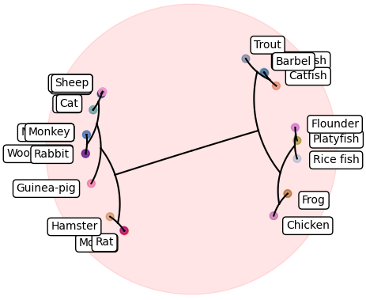
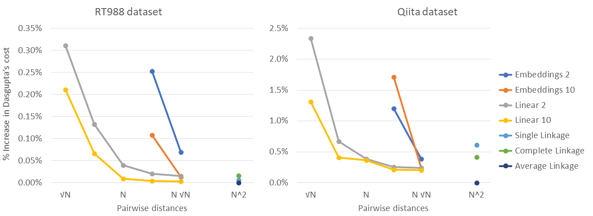
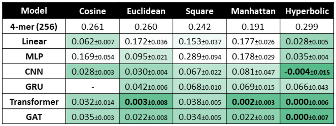

# Hierarchical Clustering



## Folder structure:

- `relaxed` contains models and scripts for the relaxed approach proposed to hierarchical clustering, a large part of this code was adapted from the repository of [HypHC](https://github.com/HazyResearch/HypHC) by Chami *et al.*
- `unsupervised` contains the common testing routine called by the `edit_distance/train.py` file for the unsupervised hierarchical clustering approach
- `task` contains scripts to generate and load the various datasets
- `baselines.py` contains the script to run the agglomerative clustering baselines

## Datasets

The pre-generate used for the experiments, can be downloaded from this [Google Drive folder](https://drive.google.com/drive/folders/1l42H0TYIhaJYyzx4GHhnmYmB2pslzVOl?usp=sharing) manually or via command line:

```
gdown --id 1ukvUI6gUTbcBZEzTVDpskrX8e6EHqVQg    # for the Qiita dataset used in unsupervised approach
gdown --id 1K_x3D-sA6DN31GRSbwfrW8R_8S5xzi3q    # for the Qiita dataset used in relaxed approach
gdown --id 1Pd7DKMiXMuWTxEJD67ACjqTP-OEi1pZm    # for the RT988 dataset used in relaxed approach
```

The dataset used for the unsupervised approach has a set of sequences disjoint from the ones the models were trained on in the edit distance approximation task.

## Tuned scripts relaxed



```
# Embeddings
python -m train --num_samples=100 --model=embeddings --rank=2 --learning_rate=1e-2 --temperature=0.01 --eval_every=5 --epochs=400  --dataset="./hc_qiita_large.pkl"
python -m train --num_samples=100 --model=embeddings --rank=10 --learning_rate=1e-2 --temperature=0.01 --eval_every=5 --epochs=400  --dataset="./hc_qiita_large.pkl"
python -m train --num_samples=1000 --model=embeddings --rank=2 --learning_rate=1e-2 --temperature=0.01 --eval_every=5 --epochs=400  --dataset="./hc_qiita_large.pkl"
python -m train --num_samples=1000 --model=embeddings --rank=10 --learning_rate=1e-2 --temperature=0.01 --eval_every=5 --epochs=400  --dataset="./hc_qiita_large.pkl"
python -m train --num_samples=10000 --model=embeddings --rank=2 --learning_rate=1e-2 --temperature=0.01 --eval_every=5 --epochs=400  --dataset="./hc_qiita_large.pkl"
python -m train --num_samples=10000 --model=embeddings --rank=10 --learning_rate=1e-2 --temperature=0.01 --eval_every=5 --epochs=400  --dataset="./hc_qiita_large.pkl"
python -m train --num_samples=100000 --model=embeddings --rank=2 --learning_rate=1e-2 --temperature=0.01 --eval_every=5 --epochs=400  --dataset="./hc_qiita_large.pkl"
python -m train --num_samples=100000 --model=embeddings --rank=10 --learning_rate=1e-2 --temperature=0.01 --eval_every=5 --epochs=400  --dataset="./hc_qiita_large.pkl"
python -m train --num_samples=1000000 --model=embeddings --rank=2 --learning_rate=1e-2 --temperature=0.01 --eval_every=5 --epochs=400  --dataset="./hc_qiita_large.pkl"
python -m train --num_samples=1000000 --model=embeddings --rank=10 --learning_rate=1e-2 --temperature=0.01 --eval_every=5 --epochs=400  --dataset="./hc_qiita_large.pkl"

# Linear
python -m train --num_samples=100 --model=linear --rank=2 --learning_rate=1e-2 --temperature=0.01 --eval_every=5 --epochs=400  --dataset="./hc_qiita_large.pkl"
python -m train --num_samples=100 --model=linear --rank=10 --learning_rate=1e-2 --temperature=0.01 --eval_every=5 --epochs=400  --dataset="./hc_qiita_large.pkl"
python -m train --num_samples=1000 --model=linear --rank=2 --learning_rate=1e-2 --temperature=0.01 --eval_every=5 --epochs=400  --dataset="./hc_qiita_large.pkl"
python -m train --num_samples=1000 --model=linear --rank=10 --learning_rate=1e-2 --temperature=0.01 --eval_every=5 --epochs=400  --dataset="./hc_qiita_large.pkl"
python -m train --num_samples=10000 --model=linear --rank=2 --learning_rate=1e-2 --temperature=0.01 --eval_every=5 --epochs=400  --dataset="./hc_qiita_large.pkl"
python -m train --num_samples=10000 --model=linear --rank=10 --learning_rate=1e-2 --temperature=0.01 --eval_every=5 --epochs=400  --dataset="./hc_qiita_large.pkl"
python -m train --num_samples=100000 --model=linear --rank=2 --learning_rate=1e-2 --temperature=0.01 --eval_every=5 --epochs=400  --dataset="./hc_qiita_large.pkl"
python -m train --num_samples=100000 --model=linear --rank=10 --learning_rate=1e-2 --temperature=0.01 --eval_every=5 --epochs=400  --dataset="./hc_qiita_large.pkl"
python -m train --num_samples=1000000 --model=linear --rank=2 --learning_rate=1e-2 --temperature=0.01 --eval_every=5 --epochs=400  --dataset="./hc_qiita_large.pkl"
python -m train --num_samples=1000000 --model=linear --rank=10 --learning_rate=1e-2 --temperature=0.01 --eval_every=5 --epochs=400  --dataset="./hc_qiita_large.pkl"

# MLP
python -m train --num_samples=100 --model=mlp --rank=2 --learning_rate=1e-2 --layers=3 --hidden_size=128 --batch_norm=False --temperature=0.1 --eval_every=5 --epochs=400  --dataset="./hc_qiita_large.pkl"
python -m train --num_samples=100 --model=mlp --rank=10 --learning_rate=1e-2 --layers=3 --hidden_size=128 --batch_norm=False --temperature=0.1 --eval_every=5 --epochs=400  --dataset="./hc_qiita_large.pkl"
python -m train --num_samples=1000 --model=mlp --rank=2 --learning_rate=1e-2 --layers=3 --hidden_size=128 --batch_norm=False --temperature=0.1 --eval_every=5 --epochs=400  --dataset="./hc_qiita_large.pkl"
python -m train --num_samples=1000 --model=mlp --rank=10 --learning_rate=1e-2 --layers=3 --hidden_size=128 --batch_norm=False --temperature=0.1 --eval_every=5 --epochs=400  --dataset="./hc_qiita_large.pkl"
python -m train --num_samples=10000 --model=mlp --rank=2 --learning_rate=1e-2 --layers=3 --hidden_size=128 --batch_norm=False --temperature=0.1 --eval_every=5 --epochs=400  --dataset="./hc_qiita_large.pkl"
python -m train --num_samples=10000 --model=mlp --rank=10 --learning_rate=1e-2 --layers=3 --hidden_size=128 --batch_norm=False --temperature=0.1 --eval_every=5 --epochs=400  --dataset="./hc_qiita_large.pkl"
python -m train --num_samples=100000 --model=mlp --rank=2 --learning_rate=1e-2 --layers=3 --hidden_size=128 --batch_norm=False --temperature=0.1 --eval_every=5 --epochs=400  --dataset="./hc_qiita_large.pkl"
python -m train --num_samples=100000 --model=mlp --rank=10 --learning_rate=1e-2 --layers=3 --hidden_size=128 --batch_norm=False --temperature=0.1 --eval_every=5 --epochs=400  --dataset="./hc_qiita_large.pkl"

# CNN
python -m train --num_samples=100 --model=cnn --rank=2 --layers=4 --channels=16 --kernel_size=3 --readout_layers=2 --non_linearity=True --pooling=avg --batch_norm=True --learning_rate=1e-2 --temperature=0.1 --eval_every=5 --epochs=400  --dataset="./hc_qiita_large.pkl"
python -m train --num_samples=100 --model=cnn --rank=10 --layers=4 --channels=16 --kernel_size=3 --readout_layers=2 --non_linearity=True --pooling=avg --batch_norm=True --learning_rate=1e-2 --temperature=0.1 --eval_every=5 --epochs=400  --dataset="./hc_qiita_large.pkl"
python -m train --num_samples=1000 --model=cnn --rank=2 --layers=4 --channels=16 --kernel_size=3 --readout_layers=2 --non_linearity=True --pooling=avg --batch_norm=True --learning_rate=1e-2 --temperature=0.1 --eval_every=5 --epochs=400  --dataset="./hc_qiita_large.pkl"
python -m train --num_samples=1000 --model=cnn --rank=10 --layers=4 --channels=16 --kernel_size=3 --readout_layers=2 --non_linearity=True --pooling=avg --batch_norm=True --learning_rate=1e-2 --temperature=0.1 --eval_every=5 --epochs=400  --dataset="./hc_qiita_large.pkl"
python -m train --num_samples=10000 --model=cnn --rank=2 --layers=4 --channels=16 --kernel_size=3 --readout_layers=2 --non_linearity=True --pooling=avg --batch_norm=True --learning_rate=1e-2 --temperature=0.1 --eval_every=5 --epochs=400  --dataset="./hc_qiita_large.pkl"
python -m train --num_samples=10000 --model=cnn --rank=10 --layers=4 --channels=16 --kernel_size=3 --readout_layers=2 --non_linearity=True --pooling=avg --batch_norm=True --learning_rate=1e-2 --temperature=0.1 --eval_every=5 --epochs=400  --dataset="./hc_qiita_large.pkl"
python -m train --num_samples=100000 --model=cnn --rank=2 --layers=4 --channels=16 --kernel_size=3 --readout_layers=2 --non_linearity=True --pooling=avg --batch_norm=True --learning_rate=1e-2 --temperature=0.1 --eval_every=5 --epochs=400  --dataset="./hc_qiita_large.pkl"
python -m train --num_samples=100000 --model=cnn --rank=10 --layers=4 --channels=16 --kernel_size=3 --readout_layers=2 --non_linearity=True --pooling=avg --batch_norm=True --learning_rate=1e-2 --temperature=0.1 --eval_every=5 --epochs=400  --dataset="./hc_qiita_large.pkl"
```

## Tuned scripts unsupervised

The tuned scripts for the unsupervised approach are those reported in the `edit_distance/README.md` file.




