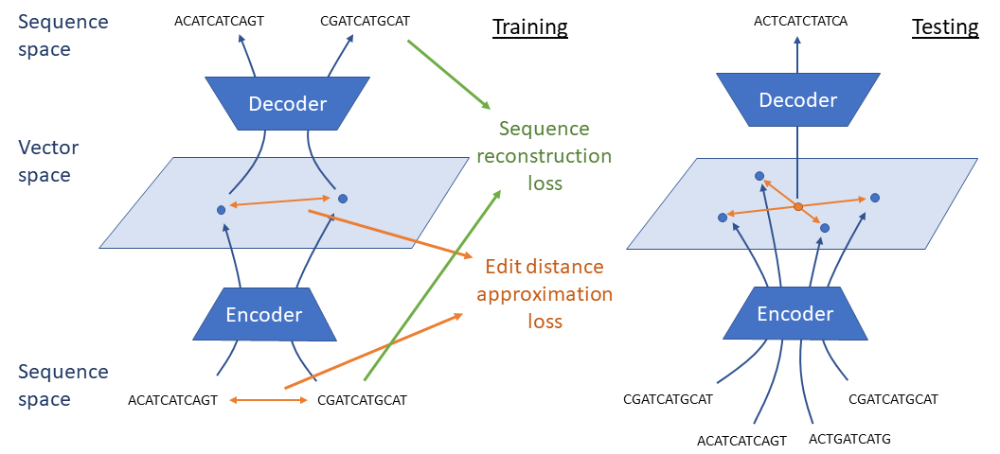
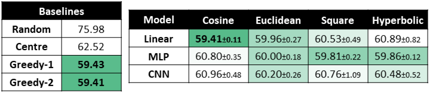

# Multiple Sequence Alignment



## Folder structure:

- `guide_tree` contains the scripts for the guide tree approach that are called called by the `edit_distance/train.py`
- `steiner_string` contains the models and scripts for the Steiner string approach:
  -  `models` contains:
     -  `pair_autoencoder.py` encoder and decoder models wrapper for training which performs preprocessing, distance calculation and postprocessing
     -  `msa_autoencoder.py` encoder and decoder models wrapper for testing which performs preprocessing, latent space optimisation and postprocessing
     -  `loss.py` contains routines for training loss and testing performance calculations
     -  a folder for every model with a `model.py` file with the `torch.nn.Module` class and a `train.py` file with the model specific argument parser
  - `task` contains scripts to generate and load the various datasets
  - `baselines.py` contains the script to run the steiner string baselines
  - `train.py` contains the common training and testing routine for all the models


## Datasets

The pre-generate used for the experiments, can be downloaded from this [Google Drive folder](https://drive.google.com/drive/folders/1l42H0TYIhaJYyzx4GHhnmYmB2pslzVOl?usp=sharing) manually or via command line:

```
gdown --id 1rjIJ3ohOqqxotgc0AXt2FgDgoDZqggdU    # RT988 dataset for the Steiner string approach
```

The guide tree approach used directly the test set of the edit distance approximation dataset on which it is trained.

## Tuned scripts Steiner string approach



```
# Linear 
python -m multiple_alignment.models.mlp.train --distance=cosine --normalization=1 --embedding_size=64 --layers=1 --alpha=0.003 --std_noise=0.1 --lr=0.001 --weight_decay=0.0  --train_mode=pair --dropout=0.0 --print_every=5 --patience=50 --epochs=500 --batch_size=128 --data="./msa_genome_large.pkl"
python -m multiple_alignment.models.mlp.train --distance=euclidean --normalization=-1 --embedding_size=64 --layers=1 --alpha=0.01 --std_noise=0.1 --lr=1e-05 --weight_decay=0.0  --train_mode=pair --lr=0.001 --dropout=0.0 --print_every=5 --patience=50 --epochs=500 --batch_size=128 --data="./msa_genome_large.pkl"
python -m multiple_alignment.models.mlp.train --distance=hyperbolic --normalization=0.25 --embedding_size=64 --layers=1 --alpha=0.003 --std_noise=0.1 --lr=1e-05 --weight_decay=0.0  --train_mode=pair --dropout=0.0 --print_every=5 --patience=50 --epochs=500 --batch_size=128 --data="./msa_genome_large.pkl"
python -m multiple_alignment.models.mlp.train --distance=square --normalization=-1 --embedding_size=64 --layers=1 --alpha=0.003 --std_noise=0.1 --lr=0.001 --weight_decay=0.0  --train_mode=pair --lr=0.001 --dropout=0.0 --print_every=5 --patience=50 --epochs=500 --batch_size=128 --data="./msa_genome_large.pkl"

# MLP
python -m multiple_alignment.models.mlp.train --distance=cosine --normalization=1 --embedding_size=64 --layers=3 --hidden_size=128 --alpha=0.01 --std_noise=0.1 --lr=1e-05 --weight_decay=0.0  --train_mode=pair --lr=0.001 --dropout=0.0 --print_every=5 --patience=50 --epochs=500 --batch_size=128 --data="./msa_genome_large.pkl"
python -m multiple_alignment.models.mlp.train --distance=euclidean --normalization=-1 --embedding_size=64 --layers=3 --hidden_size=256 --alpha=0.003 --std_noise=0.1 --lr=0.0001 --weight_decay=0.0  --train_mode=pair --lr=0.001 --dropout=0.0 --print_every=5 --patience=50 --epochs=500 --batch_size=128 --data="./msa_genome_large.pkl"
python -m multiple_alignment.models.mlp.train --distance=hyperbolic --normalization=-1 --embedding_size=64 --layers=3 --hidden_size=128 --alpha=0.01 --std_noise=0.1 --lr=1e-5 --weight_decay=0.0  --train_mode=pair --dropout=0.0 --print_every=5 --patience=50 --epochs=500 --batch_size=128 --data="./msa_genome_large.pkl"
python -m multiple_alignment.models.mlp.train --distance=square --normalization=-1 --embedding_size=64 --layers=2 --hidden_size=128 --alpha=0.01 --std_noise=0.1 --lr=1e-05 --weight_decay=0.0  --train_mode=pair --lr=0.001 --dropout=0.0 --print_every=5 --patience=50 --epochs=500 --batch_size=128 --data="./msa_genome_large.pkl"

# CNN
python -m multiple_alignment.models.convolutional.train --distance=cosine --normalization=1 --embedding_size=64 --layers=3 --channels=16 --non_linearity=True --alpha=0.01 --std_noise=0.3 --weight_decay=0.0  --train_mode=pair --lr=0.001 --dropout=0.0 --print_every=5 --patience=50 --epochs=500 --batch_size=128 --data="./msa_genome_large.pkl"
python -m multiple_alignment.models.convolutional.train --distance=euclidean --embedding_size=64 --layers=3 --channels=32 --non_linearity=False --alpha=0.003 --std_noise=0.1 --weight_decay=0.0 --normalization=-1  --train_mode=pair --lr=0.001 --dropout=0.0 --print_every=5 --patience=50 --epochs=500 --batch_size=128 --data="./msa_genome_large.pkl"
python -m multiple_alignment.models.convolutional.train --distance=hyperbolic --normalization=-1 --embedding_size=64 --layers=3 --channels=32 --non_linearity=False --alpha=0.01 --std_noise=0.1 --weight_decay=0.0  --train_mode=pair --lr=0.001 --dropout=0.0 --print_every=5 --patience=50 --epochs=500 --batch_size=128 --data="./msa_genome_large.pkl"
python -m multiple_alignment.models.convolutional.train --distance=square --embedding_size=64 --layers=3 --channels=32 --non_linearity=False --alpha=0.003 --std_noise=0.1 --weight_decay=0.0 --normalization=-1  --train_mode=pair --lr=0.001 --dropout=0.0 --print_every=5 --patience=50 --epochs=500 --batch_size=128 --data="./msa_genome_large.pkl"
```

## Tuned scripts guide tree approach

The tuned scripts for the guide tree approach are those reported in the `edit_distance/README.md` file.
These generate a `sequences.fasta` (containing the sequences in fasta format) and a `njtree.dnd`(containing the computed guide tree).
Then run `clustalw` from command line (you might need to install it first) as:

```
clustalw -infile="sequences.fasta" -dnamatrix=multiple_alignment/guide_tree/matrix.txt -transweight=0 -type='DNA' -gapopen=1 -gapext=1 -gapdist=10000 -usetree='njtree.dnd'
```


